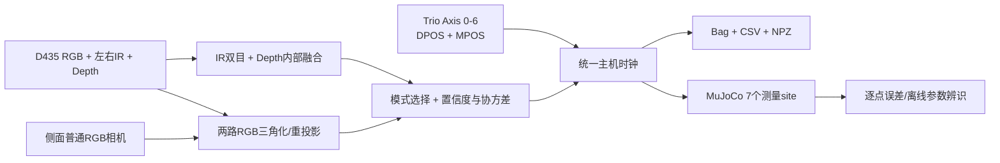

# D435连续体机器人三维关键点采集、参数辨识与动态同步

## 1. 目标与系统结构

该软件用固定安装的RealSense D435测量末端两段主动连续体的7个三维关键点，也可以增加一台普通RGB侧相机进行正交双视图融合。同时读取六根独立驱动绳和插入轴的数据。真实形状与MuJoCo中相同弧长位置进行比较，用于有效材料参数、传动误差和动态延迟辨识。



在线对齐只向MuJoCo写入七个执行器目标，不修改 `qpos`、`qvel`，也不把真实关键点作为硬约束，因此仿真仍保留惯性、阻尼、接触和回弹。

### 1.1 两种可切换模式

界面顶部的“三维测量模式”可以在停止记录时直接切换：

| 模式 | 实际数据链 | 侧相机失效时 |
|---|---|---|
| 模式1：D435＋侧面RGB双视图融合 | D435内部三维点＋侧视二维点＋两路RGB三角化 | 自动退回D435内部结果，并将来源标记为`side_missing`或`side_uncalibrated` |
| 模式2：D435双目＋Depth内部融合 | D435 RGB标记＋左右IR亚像素双目＋Depth一致性校验 | 不使用也不启动侧相机 |

模式1首先把D435三维点投影到侧相机并计算重投影误差。当D435三维点与两路RGB三角化结果一致时，按协方差进行精度加权融合，来源为`dual_fused`；当透明肺壁造成D435深度跳变时，采用两路RGB三角化结果，来源为`dual_triangulated_depth_rejected`。所有选择过程和重投影误差均写入session，不会静默替换数据。

### 1.2 所有实验设置均可在UI完成

右侧控制栏采用滚动布局，包含以下功能，不需要用命令行修改：

1. `三维测量模式`：模式1/模式2切换、侧相机Index和重连。
2. `D435数据源`：实时D435、Bag回放、模拟源及启动/停止。
3. `七轴数据源`：填写`PCMCAT`、`FLEX7`或控制器IP连接Trio，也可切换为零输入。
4. `MuJoCo实时对齐`：启用/关闭、选择XML并应用；从原主界面打开时优先复用现有MuJoCo实例。
5. `ChArUco标定`：D435外参、侧相机内参、侧相机外参的采集、求解、保存和加载。
6. `同步数据记录`：选择session根目录并开始/停止记录，完成后自动填入辨识session路径。
7. `配置文件`：保存全部当前设置，或在相机停止时加载已有配置。
8. `离线参数辨识`：选择session、设置最大帧数和迭代次数，并在独立进程中运行，避免冻结采集界面。

命令行入口保留给自动化测试和批处理，不是日常实验的必需步骤。

## 2. 环标与相机安装

### 2.1 环标位置

| 编号 | 弧长/mm | 结构位置 | 默认颜色 |
|---:|---:|---|---|
| K0 | 0 | 主动段基座 | 红 |
| K1 | 7 | 近端段1/3 | 橙 |
| K2 | 14 | 近端段2/3 | 黄 |
| K3 | 21 | 两主动段连接面 | 绿 |
| K4 | 28 | 远端段1/3 | 青 |
| K5 | 35 | 远端段2/3 | 蓝 |
| K6 | 42 | 末端 | 品红 |

推荐使用0.5–0.8 mm宽、总厚度小于0.1 mm的哑光彩色环，并在两侧增加窄黑边。彩色区域供RGB识别身份，黑边提高左右IR图像中的定位对比度。不要使用厚热缩管或凸起球体，否则会改变3.5 mm外径、质量和接触动力学。

### 2.2 相机布置

- D435与基座保持刚性连接，工作距离先设为0.25–0.40 m。
- 使42 mm主动段在图像中尽量占据较多像素，同时保证最大弯曲时不出视场。
- 使用USB 3端口；界面会记录USB模式、序列号和固件。
- 固定曝光后再采参数辨识数据，避免自动曝光造成颜色阈值漂移。
- 相机和标定板固定后不得单独移动；移动任一部件都要重新标定。
- 双视图模式下，D435放在顶部，普通RGB相机放在侧面，两光轴夹角推荐80–90°，视场中心交汇在42 mm主动段工作区域。
- 普通RGB相机应锁定曝光、白平衡和焦距；默认使用OpenCV/DirectShow后台线程并将缓存压到1帧。

D435的左右深度成像器是全局快门，适合运动目标；但其宽视场、50 mm基线会使深度噪声随距离增大。官方说明见 [Tuning depth cameras for best performance](https://dev.realsenseai.com/docs/tuning-depth-cameras-for-best-performance/) 和 [Post-processing filters](https://dev.realsenseai.com/docs/post-processing-filters/)。

## 3. 三维测量原理

左右IR图像经过设备内参标定和极线校正。设左图横坐标为 \(u_L\)，右图为 \(u_R\)，视差 \(d=u_L-u_R\)，焦距为 \(f_x\)，基线为 \(b\)，则

\[
Z=\frac{f_xb}{d},\qquad
X=\frac{(u_L-c_x)Z}{f_x},\qquad
Y=\frac{(v_L-c_y)Z}{f_y}.
\]

深度不确定度近似为

\[
\sigma_Z \approx \frac{Z^2}{f_xb}\sigma_d,
\]

说明远距离误差按 \(Z^2\) 增长。程序先在RGB中确定环标身份，用对齐Depth得到IR搜索初值，再在左右IR局部窗口中拟合亚像素中心。只有满足以下条件才采用直接双目结果：

- 视差为正且基线有效；
- 左右点的垂直误差小于配置阈值；
- 三角化深度与D435深度估计差异小于阈值。

否则回退到环标连通域内的深度中值。无有效深度时输出 `valid=0`，不会使用背景深度填充机器人点。

在线卡尔曼滤波状态为 \([p_x,p_y,p_z,v_x,v_y,v_z]^T\)。滤波只用于显示和短时遮挡预测；CSV/NPZ同时保存原始值、滤波值、预测标志和协方差，参数辨识不会丢失原始相位信息。

## 4. ChArUco基座标定

标定板参数在 `default_config.json` 中定义，默认7×5格、12 mm格长、9 mm ArUco标记。标定板坐标到机器人基座坐标的固定变换写入 `transform_base_from_board`。

操作顺序：

1. 将标定板刚性固定到实验夹具或机器人基座。
2. 启动相机并预热至少30帧。
3. 从多个角度采集至少15个有效标定帧。
4. 每帧先以PnP求解 \(T_{CB}\)，拒绝重投影误差过大的帧。
5. 对平移进行MAD离群剔除，对旋转在SO(3)上求均值。
6. 保存最终 \(T_{BC}\)、重投影RMSE、平移P95重复性和有效帧数。

标定输出变换满足

\[
{}^{base}p = {}^{base}T_{camera}\,{}^{camera}p.
\]

参数辨识时应将主动段基座固定在已知夹具上。否则被动段变形会和主动段刚度共同影响7点位置，导致参数不可辨识。

### 4.1 侧相机标定顺序

模式1需要侧相机内参和侧相机到机器人基座的外参，界面的标定目标下拉框提供三个项目：

1. `侧相机内参（移动标定板）`：保持侧相机分辨率不变，从不同距离、倾角和图像位置采集至少15帧，再求解并保存`side_camera_intrinsics.json`。
2. 将标定板刚性固定到机器人基座，且`transform_base_from_board`必须与真实安装一致。
3. 加载侧相机内参，选择`侧相机—基座外参（固定标定板）`，采集至少15帧并保存`side_camera_calibration.json`。
4. 双视图实验加载联合标定文件后，界面状态必须显示“侧相机标定有效”。

没有有效侧相机标定时，程序仍显示侧视检测结果，但明确标记`side_uncalibrated`并退回D435内部三维结果，避免使用错误几何关系。

## 5. 时间同步和七轴定义

相机每帧保存设备时间、各流时间、主机到达时间和帧号。程序在滑动窗口中拟合

\[
t_{host}=a\,t_{device}+b
\]

以补偿相机和PC时钟的缓慢漂移。Trio以100 Hz后台读取Axis 0–6，再插值到相机曝光时刻。

七轴为六个独立绳轴和一个插入轴。程序明确区分：

- `DPOS`：控制器需求位置；
- `MPOS`：编码器测量位置；
- `control_m`：通过零位、比例和拉线方向转换后的MuJoCo绝对控制量。

如果MPOS接口不可用，`measured_valid=0`并回退到DPOS；软件不会把DPOS标为实测值。

## 6. 数据目录

每次记录生成：

```text
session_YYYYMMDD_HHMMSS_xxxxxx/
├── session.json
├── calibration.json
├── realsense.bag
├── samples.csv
├── keypoints.npz
├── overlay.mp4
├── side_overlay.mp4         # 仅双视图模式
├── d435_rgb.mp4
├── side_rgb_synchronized.mp4
├── synchronized_rgb.mp4
├── video_timestamps.csv
└── summary.json
```

`session.json`保存两台相机信息、当前融合模式、USB模式、全部配置、模型路径及SHA-256。`samples.csv`保存侧相机时间戳、每点RGB/左右IR/侧视像素、IR视差、三维标准差、重投影误差和融合来源；`keypoints.npz`进一步保存完整3×3协方差矩阵。Bag保留D435原始图像和元数据。三路同步RGB视频以D435帧为主索引，`video_timestamps.csv`提供逐帧时间对应。

UI中的“三维点详细信息”支持K0–K6逐点检查，也支持点击RGB、Depth和左右IR融合稠密点云反查相机系/基座系坐标及不确定度。左右IR原始预览不再单独显示，但原始IR帧仍参与亚像素关键点匹配并写入RealSense Bag。普通侧RGB只有在像素已与D435关键点建立对应时才有三维结果。当前稠密点云可导出为基座坐标PLY和带源像素映射的NPZ；长时间实验仍以原始Bag为稠密数据母版，避免逐帧PLY造成不可控的磁盘占用。

显示视窗同时定义在线处理ROI。D435三视图（RGB、Depth、IR稠密点云）联动时，以主RGB归一化视窗作为D435颜色标记检测ROI；侧RGB使用独立视窗。颜色候选可在受控工作分辨率内快速定位，但检测结果会严格映射回原始全图像素坐标，三维计算始终使用原始内参、对齐Depth和左右IR，因此缩放、拖动不会引入三维尺度错误。画面外关键点不参与当前测量。`d435_tracking_roi`和`side_tracking_roi`逐帧记录 `[x0,y0,x1,y1]`，用于回放时复现当时的处理范围。

颜色识别不再只按固定HSV阈值和连通域面积选择，而是融合HSV色相、Lab色度、饱和度加权中心、上一帧距离和重复候选抑制。D435与侧RGB维护独立颜色原型，以适应不同白平衡。“用当前帧校准7条颜色带”只更新当前已经可靠匹配的颜色，不会用缺失点污染模型。`color_confidence`单独记录颜色阶段质量，最终`confidence`还包含IR立体匹配和Depth一致性，可据此判断误差来源。

### 6.1 启动命令

```powershell
# 模式2：仅D435内部融合
python -m Visual_information.d435_tdcr_capture --mode d435_internal

# 模式1：D435 + 侧相机Index 1
python -m Visual_information.d435_tdcr_capture --mode dual_view --side-camera-index 1

# 模式1并加载侧相机联合标定
python -m Visual_information.d435_tdcr_capture --mode dual_view --side-camera-index 1 --side-calibration .\side_camera_calibration.json

# 无硬件双视图验证
python -m Visual_information.d435_tdcr_capture --synthetic --mode dual_view
```

### 6.2 实时性能策略

采集、关键点计算和界面绘制已完全解耦。D435采集、颜色定位、Depth校验、IR亚像素匹配、滤波与记录运行在后台采集线程；Qt主线程只读取“最新完成帧”，过期显示帧不排队。稠密点云由另一条独立渲染线程计算，完成后以原子方式替换显示缓存。界面预览默认15 Hz、关键点表格与性能信息5 Hz、稠密交互点云5 Hz，因此点云排序和三维投影不会阻塞相机采集或鼠标操作。预览降频不会丢失记录帧，也不会降低关键点处理频率。

双视图模式中，D435内部RGB/IR跟踪与侧RGB颜色检测并行执行，两个结果完成后才进入三角融合；普通侧RGB相机自身也使用单独的低延迟抓帧线程和单帧缓存。OpenCV线程池默认限制为12线程，使两条视觉任务可以在24核CPU上同时运行而不产生48线程过度争抢。

颜色识别先对整幅图进行一次色相分类，再在七类互斥候选中提取轮廓，避免对同一帧重复执行七次全图HSV/Lab扫描。1280像素宽的RGB只在颜色定位阶段缩放到最多848像素宽，随后质心和掩膜映射回原始分辨率；Depth/IR三维计算未降采样。相关参数位于 `tracking.processing_max_width_px`、`ui.preview_fps`、`ui.telemetry_fps` 和 `ui.point_cloud_fps`。界面“处理耗时”显示最新完整处理帧耗时，可用于现场调整。

GPU路径支持原生OpenCV CUDA，也支持NVIDIA官方 `numba-cuda` 自定义融合内核。该内核在一次GPU调用中完成缩放、BGR→HSV和BGR→Lab，并复用显存与页锁定主机缓存。`performance.preprocess_backend=auto` 会在启动时实测CPU、OpenCL、OpenCV CUDA与Numba CUDA；只有整体收益合理时才启用GPU。当前RTX 4060在848×477小图上的PCIe往返时间高于约40万像素的CPU色彩转换时间，因此自动模式可能显示“Numba CUDA可用”但仍选择CPU，这是为了保证真实帧率。可使用 `numba_cuda` 强制GPU做对照实验，但正式采集建议保留 `auto`。

## 7. MuJoCo对应关系

模型生成器在精确弧长位置加入 `measurement_kp_0` 至 `measurement_kp_6`。零弯曲验证结果应为：

```text
[0, 7, 14, 21, 28, 35, 42] mm
```

主界面启动MuJoCo后再打开D435窗口，会复用同一个模型实例。Viewer中的黄色球为真实测量点，红线连接到对应仿真点。它们是渲染叠加物，不参与碰撞和动力学计算。

## 8. 分阶段参数辨识

辨识目标为

\[
\theta^*=\arg\min_\theta
\sum_{t,i}w_{i,t}\rho\!\left(\|p^{real}_{i,t}-p^{sim}_i(u(t-\tau),\theta)\|^2\right)
+\lambda\|\theta-\theta_0\|^2.
\]

第一阶段辨识六根绳零偏、两段传动比例和两段刚度比例；第二阶段固定静态结果，辨识两段阻尼、两段执行器时间常数和共同输入延迟。每阶段先用差分进化寻找全局初值，再用带边界Huber最小二乘精修，并输出数值灵敏度矩阵条件数。

推荐实验：

- 静态：各方向分层采样，保持到速度接近零后记录。
- 动态：单段小幅阶跃、chirp和多正弦，再进行两段组合输入。
- 训练/验证：每5帧保留1帧作为验证集，辨识程序不使用验证点优化。

命令：

```powershell
python -m Visual_information.d435_tdcr_capture.identify --session .\d435_sessions\session_xxx
```

结果写入独立profile，不自动覆盖XML。

## 9. 验收标准与边界

- 标定夹具500帧：静态中位误差目标≤1 mm，P95≤2 mm。
- 30 Hz连续采集10分钟：丢帧率<1%，相机—轴插值残差<5 ms。
- 实时端到端延迟P95目标<80 ms。
- 真实验证轨迹上，辨识后7点RMSE相对基础模型至少下降30%。

D435只能测量外部可见表面。在不透明肺模型内部，外置D435无法提供真实关键点，必须换用内置光纤、磁跟踪或其他形状传感。当前方法适用于自由空间和透明肺模型。

## 10. 研究依据

- Shentu等提出的 [MoSS](https://arxiv.org/abs/2303.00891)展示了视觉连续体形状感知及实时曲线重建。
- Ferguson等的 [Unified Shape and External Load State Estimation](https://pubmed.ncbi.nlm.nih.gov/39464302/)说明应将离散噪声测量与连续体力学先验及不确定性联合处理。
- Wang等的 [外载荷下时空网络形状估计](https://arxiv.org/abs/2510.22339)强调历史绳位移与视觉信息融合，因此本软件保留完整时间序列而非仅保存单帧形状。
- [Vid2Sid](https://arxiv.org/abs/2602.19359)展示了从真实—仿真视觉轨迹进行物理参数辨识的可行性；本项目首先采用可解释、可复现的鲁棒数值优化。
