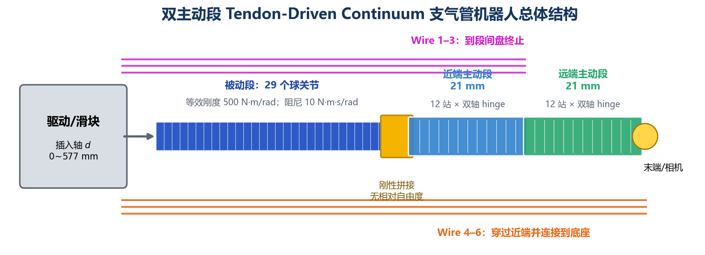
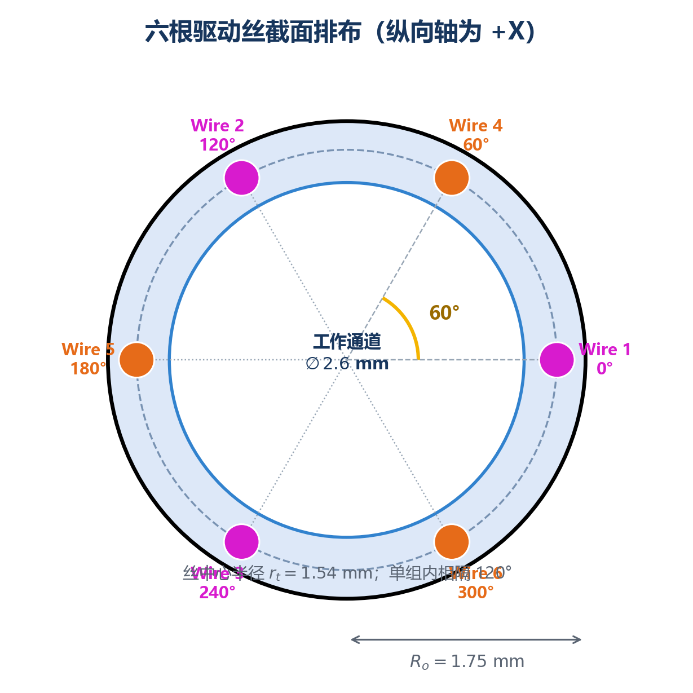
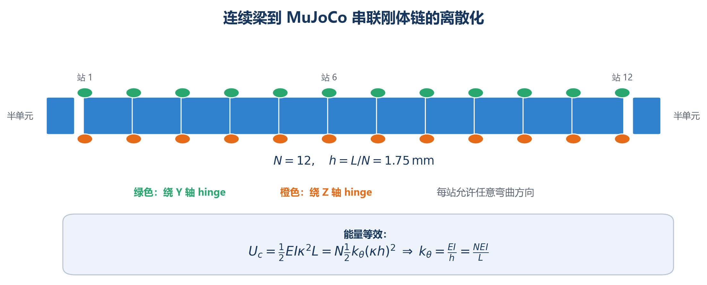
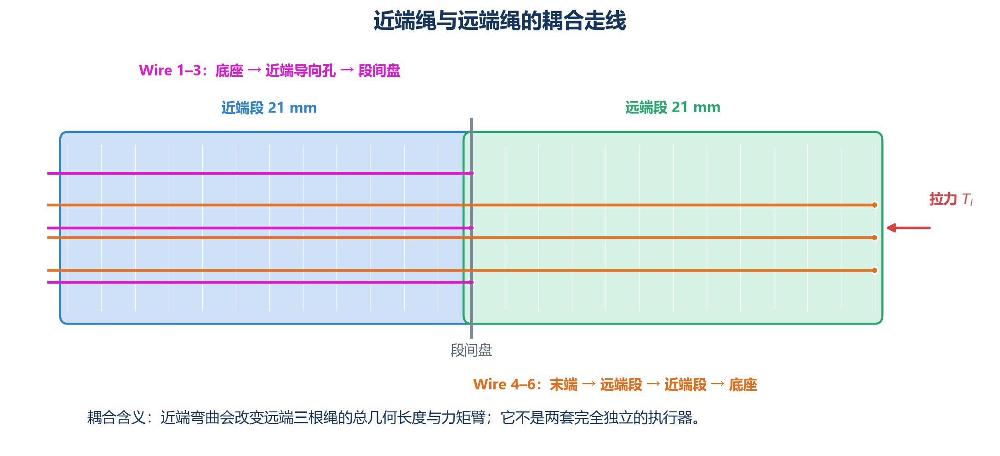
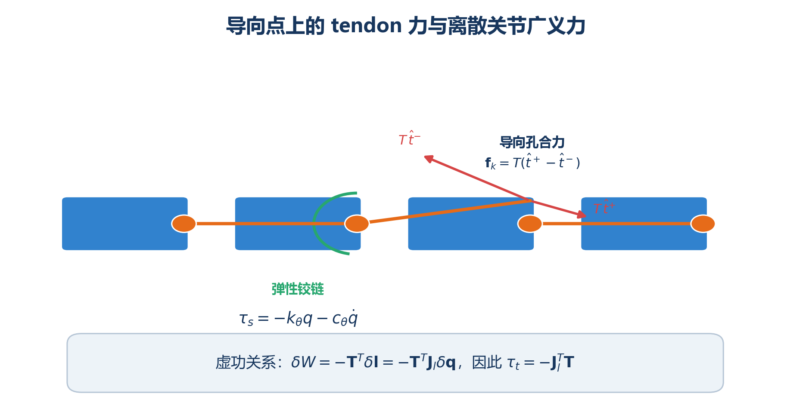
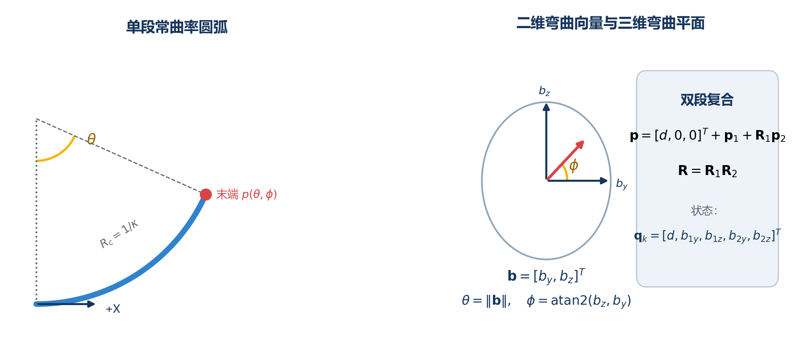
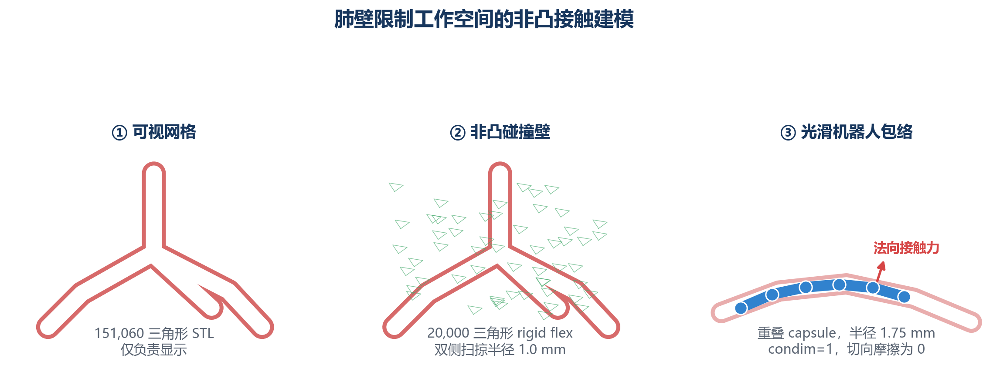
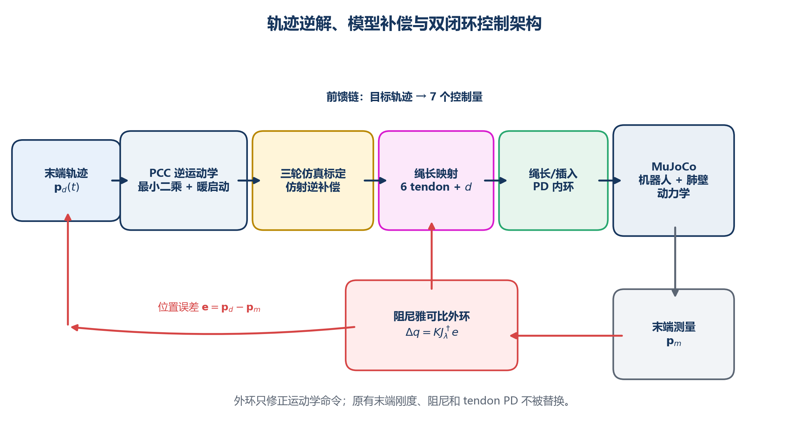
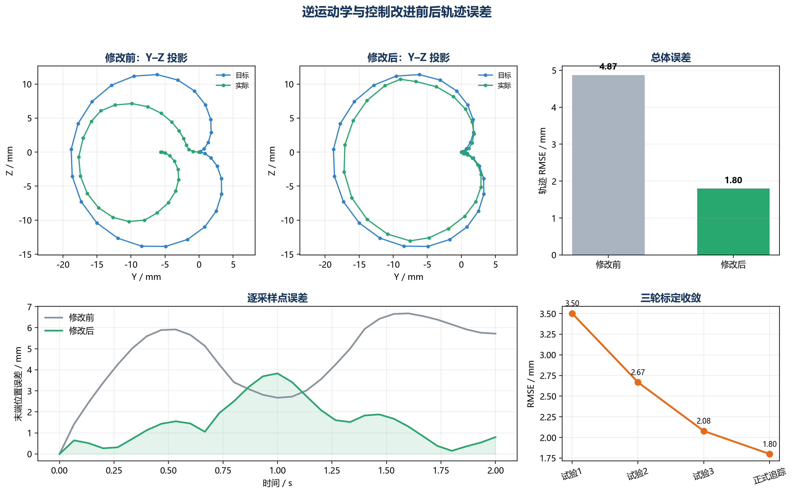

# 双主动段 Tendon-Driven Continuum 支气管机器人

## 建模、运动学、动力学、碰撞与控制原理

> **对应实现**：`brnchus_robot_VLA` 当前集成模型  
> **主模型**：[`meshes/cable_robot_bronch_final_seg2.xml`](../../meshes/cable_robot_bronch_final_seg2.xml)  
> **主动段配置**：[`two_segment_tdcr_opencr/config.json`](../../two_segment_tdcr_opencr/config.json)  
> **版本日期**：2026-07-24

---

## 摘要

本模型用于模拟一套支气管介入连续体机器人：前端由两段各长 21 mm 的主动 Tendon-Driven Continuum Robot（TDCR）组成，后端连接一段可插入、可被动弯曲的柔顺导管，并在非凸肺/支气管内壁中运动。整个系统具有 7 个外部控制量：Wire 1–6 的六个绝对目标绳长以及一个轴向插入量。

模型采用三层互补描述：

1. **快速运动学层**：两段分段常曲率（Piecewise Constant Curvature, PCC）模型，用于末端正运动学、逆运动学和雅可比计算。
2. **动力学层**：参考 [OpenCR-MuJoCo](https://github.com/ContinuumRoboticsLab/opencr-mujoco) 的建模思想，将连续骨架离散为串联刚体单元，在相邻单元之间布置两条正交转动关节，并使用 MuJoCo 原生 spatial tendon 计算绳路、绳长、速度和广义力。
3. **环境接触层**：使用固定的二维 non-convex `flexcomp` 表示支气管内壁，机器人使用重叠 capsule 碰撞包络，以较硬的无摩擦法向接触限制其工作空间。

PCC 是控制器的快速先验，而不是最终动力学真值。实际运动由离散多体动力学、绳张力、弹性、阻尼、惯性、插入驱动和肺壁接触共同决定。为补偿两者之间的模型偏差，轨迹跟踪采用“解析逆运动学 + 三轮 MuJoCo 仿射标定 + 阻尼雅可比外环 + tendon/插入 PD 内环”的控制结构。



**图 1　系统总体结构。** Wire 1–3 控制近端主动段；Wire 4–6 从末端穿过远端段和近端段，最终连接到底座，因此存在真实的段间耦合。

---

## 1. 系统构成与建模目标

### 1.1 机器人拓扑

从驱动端到末端，模型依次包含：

1. 轴向插入滑块；
2. 29 个被动球关节组成的长柔顺段；
3. 被动段与主动段之间的刚性、共面拼接；
4. 近端主动段（Section 1，21 mm）；
5. 段间连接盘；
6. 远端主动段（Section 2，21 mm）；
7. 末端定位点、相机和末端轨迹传感器。

主动段的总长度为 42 mm。末端两段用于快速全方向转向；被动段随插入和肺壁接触发生柔顺形变；插入滑块控制机器人整体沿导向方向推进或回撤。

### 1.2 七个外部控制量

控制向量定义为

$$
\mathbf u=
\begin{bmatrix}
l_{1,d} & l_{2,d} & l_{3,d} & l_{4,d} & l_{5,d} & l_{6,d} & d_d
\end{bmatrix}^{T},
$$

其中 $l_{i,d}$ 是第 $i$ 根 tendon 的**绝对目标总长度**，单位为 m；$d_d$ 是插入滑块的目标位移，单位为 m。actuator 控制的不是直接拉力，而是绳长目标；绳张力由目标长度与实际长度之间的误差通过 PD 伺服产生，并限制为只能拉、不能推。

### 1.3 三种“自由度”应当区分

- **任务/控制自由度**：6 个弯曲输入 + 1 个插入输入，共 7 个外部控制量。
- **PCC 运动学状态**：$[d,b_{1y},b_{1z},b_{2y},b_{2z}]^T$，共 5 个独立运动学变量。每组三根绳存在共模冗余；统一增减三根绳主要改变预紧，而差分绳长决定二维弯曲。
- **MuJoCo 内部动力学自由度**：主动段包含 $2\times12\times2=48$ 个 hinge 自由度；被动段包含 29 个 ball joint，即 87 个速度自由度。内部高维自由度用于描述柔性形状和接触，不等于外部控制通道数。

---

## 2. 坐标系、符号与约定

### 2.1 坐标系

主动连续体的未弯曲纵向轴定义为 $+X$。截面平面为 $Y$–$Z$ 平面：

- 截面极角 $0^\circ$ 指向 $+Y$；
- 截面极角 $90^\circ$ 指向 $+Z$；
- 单段弯曲方向角记为 $\phi$；
- 单段总弯曲角记为 $\theta$；
- 曲率为 $\kappa=\theta/L$。

局部 `base_frame` 定义在主动段底座，`tip_center` 定义在远端段末端。逆运动学轨迹和误差均先转换到初始 `base_frame` 坐标系：

$$
\mathbf p_{\text{local}}
=\mathbf R_{0}^{T}\left(\mathbf p_{\text{world}}-\mathbf o_0\right).
$$

### 2.2 常用符号

| 符号 | 含义 | 当前值/单位 |
|---|---|---:|
| $L$ | 单个主动段长度 | 0.021 m |
| $N$ | 每段离散关节站数量 | 12 |
| $h=L/N$ | 单个离散单元长度 | 0.00175 m |
| $R_o$ | 连续体外半径 | 0.00175 m |
| $R_i$ | 工作通道半径 | 0.00130 m |
| $r_t$ | tendon 中心到截面中心距离 | 0.00154 m |
| $d_w$ | 驱动丝直径 | 0.00015 m |
| $E$ | 均匀化等效杨氏模量 | 20 MPa |
| $\nu$ | 泊松比 | 0.33 |
| $\rho$ | 等效密度 | 6450 kg/m³ |
| $k_\theta$ | 主动段单 hinge 转动刚度 | 0.0585486 N·m/rad |
| $c_\theta$ | 主动段单 hinge 阻尼 | 0.006 N·m·s/rad |
| $K_t$ | tendon 长度位置增益 | 30000 N/m |
| $D_t$ | tendon 速度增益 | 0.5 N·s/m |
| $T_0$ | 每根绳预紧力 | 0.3 N |
| $T_{\max}$ | 每根绳最大拉力 | 15 N |

> **重要说明**：$E=20$ MPa 是“激光切槽 NiTi 骨架 + TPU 包覆 + 空心通道”的整体均匀化初值，不是块状 NiTi 的真实杨氏模量。它需要通过实物的力—位移—形状数据重新辨识。

---

## 3. 主动连续体的几何与离散力学建模

### 3.1 截面几何与六绳排布

连续体外径为 3.5 mm，中心工作通道直径为 2.6 mm。六根驱动丝均位于半径 $r_t=1.54$ mm 的圆周上。Wire 1–3 属于近端组，Wire 4–6 属于远端组；同一组三根绳相隔 $120^\circ$，两组交错后相邻绳相隔 $60^\circ$。



**图 2　六根 tendon 的截面排布。** 洋红色为近端组，橙色为远端组。

| Wire | 极角 $\alpha_i$ | 控制对象 | 直线参考长度 |
|---:|---:|---|---:|
| 1 | $0^\circ$ | 近端段 | 21 mm |
| 2 | $120^\circ$ | 近端段 | 21 mm |
| 3 | $240^\circ$ | 近端段 | 21 mm |
| 4 | $60^\circ$ | 远端段，穿过近端段 | 42 mm |
| 5 | $180^\circ$ | 远端段，穿过近端段 | 42 mm |
| 6 | $300^\circ$ | 远端段，穿过近端段 | 42 mm |

### 3.2 空心环形截面的梁参数

空心圆环截面积为

$$
A=\pi\left(R_o^2-R_i^2\right),
$$

截面对任一中心弯曲轴的二次面积矩为

$$
I=\frac{\pi}{4}\left(R_o^4-R_i^4\right),
$$

极惯性矩为

$$
J_p=2I,
$$

剪切模量为

$$
G=\frac{E}{2(1+\nu)}.
$$

代入当前参数得到

$$
\begin{aligned}
A&=4.31184\times10^{-6}\ \mathrm{m^2},\\
I&=5.12300\times10^{-12}\ \mathrm{m^4},\\
EI&=1.02460\times10^{-4}\ \mathrm{N\,m^2},\\
m_{\text{section}}&=\rho A L=5.84038\times10^{-4}\ \mathrm{kg}.
\end{aligned}
$$

该等效梁参数决定主动段的基础弹性响应。切槽形状、TPU 黏弹性、驱动丝与通道摩擦没有由截面尺寸自动得到，而是被合并到等效 $E$、关节阻尼和 tendon 控制参数中。

### 3.3 从连续梁到串联刚体链

每个 21 mm 主动段被离散为 $N=12$ 个关节站。每个站设置两个相互正交的 hinge：一个绕局部 $Y$ 轴，一个绕局部 $Z$ 轴，使该站能够产生任意截面方向的弯曲。段首和段尾采用半长度单元，避免离散节点相对连续梁端点产生半单元偏移。



**图 3　连续梁到串联刚体链的离散化。** 每个离散站包含 Y、Z 两个正交 hinge。

转动刚度由弯曲应变能等效得到。对于曲率恒定的连续梁，弹性能为

$$
U_c=\frac{1}{2}EI\kappa^2L.
$$

离散后，每个关节转角为 $q_j\approx\kappa h$，总弹性能为

$$
U_d=N\frac{1}{2}k_\theta(\kappa h)^2.
$$

令 $U_c=U_d$，得到

$$
\boxed{k_\theta=\frac{EI}{h}=\frac{NEI}{L}}.
$$

当前模型中

$$
k_\theta=0.0585486\ \mathrm{N\,m/rad}.
$$

单个主动 hinge 的回复力矩近似为

$$
\tau_{s,j}=-k_\theta(q_j-q_{j,0})-c_\theta\dot q_j,
$$

其中自然角 $q_{j,0}=0$，$c_\theta=0.006$ N·m·s/rad。每个关节的角度范围为 $[-0.35,0.35]$ rad，数值 armature 在自由空间中为 $10^{-10}$ kg·m²。

### 3.4 为什么使用离散多体模型

离散模型与单纯 PCC 模型相比，能够直接表达：

- 非均匀曲率；
- 分布质量和惯性；
- 关节阻尼；
- tendon 在每个导向点产生的离散载荷；
- 与复杂非凸肺壁发生的多点接触；
- 快速运动时的振动、回弹和瞬态响应。

这与 OpenCR-MuJoCo 的核心思想一致：将连续骨架拆分为刚体链，用成对 hinge 表示双向弯曲，用 $NEI/L$ 计算离散关节刚度，并使用 MuJoCo 原生 tendon 模型走线和施力。

---

## 4. Tendon 走线、绳长与驱动力

### 4.1 空间 tendon 路径

每个关节站在 $r_t=1.54$ mm 偏心半径处建立导向 `site`。MuJoCo spatial tendon 按 XML 中 `site` 出现的顺序连接这些点。对第 $i$ 根绳，其几何总长度为

$$
l_i(\mathbf q)=\sum_{k=0}^{n_i-1}
\left\|\mathbf p_{i,k+1}(\mathbf q)-\mathbf p_{i,k}(\mathbf q)\right\|_2.
$$

MuJoCo 官方文档将 spatial tendon 定义为依次穿过给定 via-points 的最短路径；因此 guide site 的顺序同时定义了绳路拓扑和总绳长。



**图 4　两组 tendon 的走线。** Wire 4–6 穿过两个主动段，近端弯曲会改变其几何长度和载荷方向。

近端三根绳的有效路径为

$$
\text{base}\rightarrow\text{Section 1 guides}\rightarrow\text{interface},
$$

远端三根绳的有效路径为

$$
\text{base}\rightarrow\text{Section 1 guides}\rightarrow
\text{interface}\rightarrow\text{Section 2 guides}\rightarrow\text{tip}.
$$

因此远端绳不仅作用于远端段，也会通过近端段内的偏心走线向近端段施加力矩。这种段间耦合由实际 tendon 几何自动产生，不应通过把两段完全隔离来消除。

### 4.2 单段常曲率绳长映射

对长度为 $L$、弯曲角为 $\theta$、弯曲方向为 $\phi$ 的单段，第 $i$ 根偏心绳的理想长度变化为

$$
\Delta l_i=-r_t\theta\cos(\alpha_i-\phi),
$$

所以目标绳长为

$$
\boxed{l_{i,d}=l_{i,0}-r_t\theta\cos(\alpha_i-\phi)}.
$$

沿弯曲内侧的绳缩短，外侧的绳变长。对于三根相隔 $120^\circ$ 的绳，有

$$
\sum_{i=1}^{3}\Delta l_i=0,
$$

因此纯差分绳长可以改变弯曲而不改变平均绳长；三根绳的公共长度偏移主要改变预紧或轴向压缩状态。

对于穿过两段的远端绳，其总几何长度在理想常曲率近似下可以写成

$$
l_i\approx 2L-r_t\theta_1\cos(\alpha_i-\phi_1)
-r_t\theta_2\cos(\alpha_i-\phi_2),\qquad i=4,5,6.
$$

控制器只直接给出期望远端弯曲对应的目标长度差；近端弯曲引起的附加长度变化由 spatial tendon 的实时几何长度进入 PD 误差，从而自然表现为耦合载荷。

### 4.3 罗盘输入到三绳长度

每段罗盘输入为二维向量

$$
\mathbf c_s=[c_x,c_y]^T,\qquad \|\mathbf c_s\|\le1.
$$

它转换为

$$
\theta_s=\theta_{\max}\|\mathbf c_s\|,
\qquad
\phi_s=\operatorname{atan2}(c_y,c_x),
$$

其中每段最大命令角为 $\theta_{\max}=160^\circ$。然后使用上一节的余弦映射产生对应三根绳的绝对目标长度。该方法使罗盘任意方向都转换为三根绳协调的长短变化，不再向末端刚体直接施加虚拟力矩。

### 4.4 绳长 PD actuator 与预紧

MuJoCo tendon actuator 的当前控制律等价为

$$
F_i=K_t\left(l_{i,d}-l_i\right)-D_t\dot l_i,
$$

其中

$$
K_t=30000\ \mathrm{N/m},\qquad
D_t=0.5\ \mathrm{N\,s/m}.
$$

模型采用负 actuator force 表示拉力，并设置

$$
-15\ \mathrm N\le F_i\le0,
$$

从而 tendon 只能拉动，不能产生推力。

直线状态下希望存在预紧力 $T_0=0.3$ N，目标控制长度设置为

$$
l_{i,d}^{0}=l_{i,0}-\frac{T_0}{K_t}.
$$

当前近端直线目标约为 $20.99$ mm，远端直线目标约为 $41.99$ mm。控制范围按照 $r_t\theta_{\max}$ 的最大绳长行程设置：

| Actuator | `ctrlrange` / m | `forcerange` / N |
|---|---:|---:|
| `act_t1`–`act_t3` | 0.0166895 – 0.0253005 | -15 – 0 |
| `act_t4`–`act_t6` | 0.0376895 – 0.0463005 | -15 – 0 |

### 4.5 Tendon 广义力

定义 tendon 长度雅可比

$$
\mathbf J_l(\mathbf q)=\frac{\partial\mathbf l}{\partial\mathbf q}.
$$

根据虚功关系

$$
\delta W=-\mathbf T^T\delta\mathbf l
=-\mathbf T^T\mathbf J_l\delta\mathbf q,
$$

得到 tendon 对关节的广义力

$$
\boxed{\boldsymbol\tau_t=-\mathbf J_l^T\mathbf T}.
$$

在单个导向点处，如果绳在导向点前后的单位方向分别为 $\hat{\mathbf t}^{-}$ 和 $\hat{\mathbf t}^{+}$，则导向孔受到的合力近似为

$$
\mathbf f_k=T\left(\hat{\mathbf t}^{+}-\hat{\mathbf t}^{-}\right).
$$



**图 5　导向点处的 tendon 力和弹性 hinge 回复力矩。** MuJoCo 根据实时几何计算 tendon 方向、长度速度和广义力。

---

## 5. 分段常曲率正运动学

### 5.1 PCC 的角色和假设

PCC 假设单个主动段在当前时刻形成曲率恒定、无轴向伸长、无剪切的圆弧。它计算快且适合实时逆解，但不直接描述质量、接触、非均匀曲率和 tendon 摩擦。因此本项目使用 PCC 生成控制先验，再由 MuJoCo 动力学修正和验证。



**图 6　单段常曲率和两段变换复合。** 弯曲向量的模是总弯曲角，方向给出弯曲平面。

### 5.2 单段弯曲参数

程序使用二维弯曲向量

$$
\mathbf b=
\begin{bmatrix}b_y\\b_z\end{bmatrix}.
$$

定义

$$
\theta=\sqrt{b_y^2+b_z^2},\qquad
\cos\phi=\frac{b_y}{\theta},\qquad
\sin\phi=\frac{b_z}{\theta}.
$$

旋转轴为

$$
\mathbf a=
\begin{bmatrix}0&-\sin\phi&\cos\phi\end{bmatrix}^{T}.
$$

记 $[\mathbf a]_\times$ 为反对称矩阵，则 Rodrigues 公式给出单段末端旋转：

$$
\mathbf R(\theta,\phi)=
\mathbf I+\sin\theta[\mathbf a]_\times
+(1-\cos\theta)[\mathbf a]_\times^2.
$$

单段末端位置为

$$
\mathbf p(\theta,\phi)=
\begin{bmatrix}
L\dfrac{\sin\theta}{\theta}\\[4pt]
L\dfrac{1-\cos\theta}{\theta}\cos\phi\\[4pt]
L\dfrac{1-\cos\theta}{\theta}\sin\phi
\end{bmatrix}.
$$

当 $\theta\rightarrow0$ 时，使用连续极限

$$
\mathbf p\rightarrow[L,0,0]^T,
\qquad
\mathbf R\rightarrow\mathbf I,
$$

避免除零和小角度数值误差。

### 5.3 两段正运动学

PCC 状态定义为

$$
\mathbf q_k=
\begin{bmatrix}
d&b_{1y}&b_{1z}&b_{2y}&b_{2z}
\end{bmatrix}^{T}.
$$

分别计算两段变换 $(\mathbf p_1,\mathbf R_1)$ 和 $(\mathbf p_2,\mathbf R_2)$，则末端位置和姿态为

$$
\boxed{
\mathbf p_{tip}=
\begin{bmatrix}d\\0\\0\end{bmatrix}
+\mathbf p_1+\mathbf R_1\mathbf p_2
},
$$

$$
\boxed{\mathbf R_{tip}=\mathbf R_1\mathbf R_2}.
$$

末端切向方向取

$$
\mathbf t_{tip}=\mathbf R_{tip}\mathbf e_x,
\qquad
\mathbf e_x=[1,0,0]^T.
$$

### 5.4 位置雅可比

位置雅可比为

$$
\mathbf J_p(\mathbf q_k)=
\frac{\partial\mathbf p_{tip}}{\partial\mathbf q_k}
\in\mathbb R^{3\times5}.
$$

程序使用中心差分计算：

$$
\mathbf J_p[:,j]\approx
\frac{\mathbf p(\mathbf q_k+\epsilon_j\mathbf e_j)
-\mathbf p(\mathbf q_k-\epsilon_j\mathbf e_j)}{2\epsilon_j}.
$$

插入轴步长为 $10^{-5}$ m，四个弯曲变量步长为 $10^{-4}$ rad。数值雅可比一方面避免了复杂的双段解析微分，另一方面与实际代码中的正运动学表达完全一致。

---

## 6. 逆运动学

### 6.1 轨迹输入

逆解接收离散时间序列

$$
\left\{t_k,\mathbf p_{d,k},\mathbf t_{d,k}\right\}_{k=0}^{M-1},
$$

其中 $\mathbf p_{d,k}$ 是目标位置，$\mathbf t_{d,k}$ 是期望末端切向。CSV 可以显式提供切向；若未提供，则由轨迹位置的时间梯度归一化得到。

默认测试轨迹由可达 PCC 状态生成：

$$
\begin{aligned}
\sigma&\in[0,1],\qquad d=0.045\sigma,\\
w(\sigma)&=\sin^2(\pi\sigma),\\
\theta_1&=32^\circ w(\sigma),\\
\theta_2&=24^\circ w(\sigma),\\
\phi_1&=2\pi\sigma,\\
\phi_2&=2\pi\sigma+55^\circ.
\end{aligned}
$$

### 6.2 加权非线性最小二乘

每个轨迹点求解

$$
\mathbf q_k^*=\arg\min_{\mathbf q_k}\|\mathbf r(\mathbf q_k)\|_2^2.
$$

残差由四部分组成：

$$
\mathbf r=
\begin{bmatrix}
(\mathbf p(\mathbf q_k)-\mathbf p_{d,k})/0.001\\
7.5(\mathbf t(\mathbf q_k)-\mathbf t_{d,k})\\
0.003\,\mathbf S_s^{-1}(\mathbf q_k-\mathbf q_{k-1})\\
100\,\mathbf r_{limit}
\end{bmatrix}.
$$

第一项以 1 mm 为位置尺度；第二项限制末端朝向；第三项抑制相邻逆解跳支和控制不连续；第四项惩罚单段弯曲模长超过 $160^\circ$。平滑尺度为

$$
\mathbf S_s=\operatorname{diag}
\left(0.05,\theta_{max},\theta_{max},\theta_{max},\theta_{max}\right).
$$

约束范围为

$$
0\le d\le d_{max},
\qquad
-\theta_{max}\le b_{sy},b_{sz}\le\theta_{max}.
$$

求解器使用上一轨迹点的结果进行暖启动，保证选取连续的解分支。最终 PCC 状态再通过余弦绳长公式转换为六根 tendon 目标长度和插入目标。

### 6.3 为什么解析逆解仍有误差

即使 PCC 方程本身的残差接近 0，MuJoCo 实际轨迹仍可能偏离目标，主要原因包括：

- 远端绳穿过近端导致段间耦合；
- 离散关节只能近似连续圆弧；
- tendon PD 具有有限带宽和最大拉力；
- 被动段和插入机构会运动；
- 实际形状并非严格常曲率；
- 动态惯性和阻尼引入相位滞后；
- 与肺壁接触时目标形状可能在几何上不可达。

因此“PCC IK 残差很小”不等价于“完整动力学末端误差很小”。

---

## 7. 完整多体动力学

### 7.1 MuJoCo 方程

MuJoCo 使用广义坐标 $\mathbf q$ 和广义速度 $\mathbf v$ 求解

$$
\boxed{
\mathbf M(\mathbf q)\dot{\mathbf v}
+\mathbf c(\mathbf q,\mathbf v)
=\boldsymbol\tau
+\mathbf J_c^T\mathbf f_c
},
$$

其中：

- $\mathbf M$ 是关节空间惯性矩阵；
- $\mathbf c$ 包含科氏、离心和重力等偏置力；
- $\boldsymbol\tau$ 包含 tendon、插入 actuator、弹簧、阻尼和其他外力；
- $\mathbf J_c$ 是约束/接触雅可比；
- $\mathbf f_c$ 是约束空间中的接触力。

模型使用 `implicitfast` 积分器，时间步长为

$$
\Delta t=2\times10^{-4}\ \mathrm s,
$$

即 5000 Hz 物理更新。集成 XML 使用 120 次求解迭代和 $10^{-9}$ 容差，以处理较硬肺壁接触和轻质主动关节。

### 7.2 主动段弹性、阻尼和惯性

主动关节的广义回复力可写为

$$
\boldsymbol\tau_a
=-\mathbf K_a(\mathbf q_a-\mathbf q_{a,0})
-\mathbf D_a\mathbf v_a
+\boldsymbol\tau_t.
$$

其中 $\mathbf K_a$ 和 $\mathbf D_a$ 由每个 Y/Z hinge 的 $k_\theta$、$c_\theta$ 构成对角阵，$\boldsymbol\tau_t$ 来自六根 spatial tendon。自由空间 armature 极小，以保留快速弯曲响应。

### 7.3 被动段

被动段含 29 个 ball joint。当前基准参数为：

$$
k_p=500\ \mathrm{N\,m/rad},\qquad
c_p=10\ \mathrm{N\,m\,s/rad},\qquad
a_p=0.01\ \mathrm{kg\,m^2}.
$$

每个 ball joint 在速度空间具有三个转动自由度。UI 中的“被动关节等效参数”不会重建模型，而是运行时统一缩放：

$$
k_p^{eff}=s_k k_p,qquad
c_p^{eff}=s_c c_p.
$$

其中刚度倍率 $s_k$ 的 UI 范围为 0.10–5.00，阻尼倍率 $s_c$ 的范围为 0.10–5.00。减小刚度使被动段更容易被肺壁和末端拉弯；增大阻尼主要抑制动态摆动，而不直接改变静态平衡刚度。

### 7.4 插入滑块

插入关节范围为 0–0.577 m，关节参数为

$$
a_d=0.1\ \mathrm{kg},\quad
c_d=5\ \mathrm{N\,s/m},\quad
f_{loss}=0.2\ \mathrm N.
$$

插入 actuator 使用

$$
F_d=K_d(d_d-d)-D_d\dot d,
$$

其中

$$
K_d=2000\ \mathrm{N/m},\qquad
D_d=80\ \mathrm{N\,s/m},
$$

并限制在

$$
-5000\ \mathrm N\le F_d\le5000\ \mathrm N.
$$

较大的力上限用于在长被动段和肺壁接触阻力下保持快速插入响应；实际作用力仍由位置误差和阻尼项决定，并不是始终输出 5000 N。

### 7.5 重力设置

独立 TDCR 生成配置使用零重力。集成 XML 本身保留 $[0,0,-9.81]$ m/s²；当前逆运动学轨迹验证脚本在加载模型后显式将 `model.opt.gravity[:]` 设为 0，用于隔离运动学和 tendon 控制误差。因此：

- 主 UI/完整环境可以使用集成模型的重力；
- IK 验证结果是零重力条件下的控制性能；
- 若要在有重力、不同姿态或实物中使用，应重新执行模型标定或增加重力补偿。

---

## 8. 被动—主动刚性拼接和光滑外形

主动底座 `active_tdcr_base` 被直接重新挂接为被动末端刚体 `cable_stiffB_last` 的子节点。连接处不设置 free joint，也不依赖数值 `weld` equality；因此两者在刚体树中共享同一刚性运动，理论上不存在六维相对自由度。

被动段外径统一为 3.5 mm，与主动段完全一致。连接面被调整为共面，避免视觉间隙和碰撞台阶。原来跨越接头的三个平端圆柱只保留显示和质量作用，实际碰撞由一个半径 1.75 mm 的 `splice_collision_fairing` capsule 覆盖。该 capsule 从被动末端延伸到主动段前部，使接触法线沿连接处连续变化，减少在支气管分叉处“卡台阶”的现象。

---

## 9. 肺壁非凸碰撞模型

### 9.1 为什么不能直接使用普通 mesh geom

支气管 STL 是多分支、内部中空的强非凸曲面。普通碰撞 mesh 往往按凸化结果参与接触，会把中空分支错误地封闭。当前模型将显示和碰撞分离：

- `bronchus.stl`：151,060 个三角形，仅用于高精度显示；
- `bronchus_collision_solid_nonconvex.stl`：20,000 个三角形，用作固定二维 non-convex flex 碰撞面。

`flexcomp` 设置 `rigid="true"`，因此它只提供三角面碰撞，不增加肺壁形变自由度。MuJoCo 官方文档说明 `flexcomp` 是生成 flex、相关顶点/刚体和可选约束的宏；在此模型中全部顶点固定到父刚体，从而形成不可移动的非凸边界。



**图 7　肺壁显示网格、非凸碰撞面和机器人 capsule 包络。** 肺壁的主要作用是限制工作空间，而不是模拟软组织变形。

### 9.2 肺壁接触参数

当前肺壁碰撞参数为：

| 参数 | 当前值 | 作用 |
|---|---:|---|
| flex `radius` | 1.0 mm | 在三角面两侧形成有限碰撞厚度 |
| `margin` | 0.3 mm | 提前生成接触，降低高速穿透风险 |
| `condim` | 1 | 只求解法向接触约束 |
| `friction` | 0, 0, 0 | 不产生切向、扭转和滚动摩擦 |
| `solref` | 0.0004, 1 | 0.4 ms 接触时间常数、阻尼比 1 |
| `solimp` | 0.9999, 0.9999, 0.0001 | 接近硬约束的高阻抗接触 |
| `priority` | 10 | 肺壁参数优先覆盖接触对另一侧参数 |

由于 $\Delta t=0.2$ ms，`solref[0]=0.4` ms 正好等于 $2\Delta t$，满足 MuJoCo `refsafe` 对过小接触时间常数的安全下限。高阻抗、较小时间步和 rounded capsule 联合降低穿模概率。

### 9.3 为什么接触设为无摩擦

肺壁在当前任务中的主要作用是限制可达工作空间。若使用三维摩擦接触，轻质、柔软、具有大量离散关节的连续体容易出现：

- 分支处静摩擦锁死；
- 粘滑切换导致高频振动；
- 被动—主动连接处卡住；
- 多接触点同时求解导致仿真速度下降。

因此使用 `condim=1` 和零摩擦，只保留不允许穿过壁面的法向约束。它表示“高度润滑的支气管界面”，不应被解释为真实黏膜摩擦系数已被辨识。

### 9.4 机器人光滑 capsule 包络

被动段和主动段原始平端 cylinder 碰撞几何被关闭，另加相互重叠的 capsule 作为碰撞包络：

- capsule 半径为 1.75 mm；
- 相邻 capsule 连续重叠，消除关节处凹槽；
- 被动段 capsule 的接触掩码为 1/1；
- 主动段 capsule 使用 1/0，与肺壁 flex 的 1/1 匹配，同时减少机器人自碰撞；
- 所有机器人包络使用 `condim=1`、零摩擦和与肺壁相同的硬接触参数。

肺壁碰撞 flex 单独位于 Group 4；光滑机器人碰撞包络位于 Group 5。Viewer 中可用相应数字键切换显示。

### 9.5 接触时的数值正则化

自由空间中主动 hinge armature 为 $10^{-10}$ kg·m²，以保持快速响应。当检测到主动段与肺壁真实接触时，程序暂时将主动 hinge armature 提升到

$$
a_{contact}=10^{-5}\ \mathrm{kg\,m^2},
$$

并在离开接触后保持 0.03 s 再恢复。该处理只抑制接触激发的子时间步高频加速度：

- 不锁止关节；
- 不重置 $q$ 或 $\dot q$；
- 不修改目标绳长；
- 不改变主动段弹性刚度和自由空间阻尼；
- 接触后的形变和回弹仍由真实动力学产生。

---

## 10. 控制系统



**图 8　完整控制架构。** PCC 逆解提供前馈，三轮隐藏试验学习模型偏差，阻尼雅可比构成位置外环，tendon 和插入 PD 为快速内环。

### 10.1 控制层次

控制器分为四层：

1. **轨迹层**：给定 $\mathbf p_d(t)$ 和可选末端切向 $\mathbf t_d(t)$；
2. **运动学层**：PCC IK 求出 $\mathbf q_k(t)$；
3. **任务空间外环**：根据实时末端误差修正 $\mathbf q_k$；
4. **执行器内环**：将修正后的弯曲状态转换成六根绳长目标，并由 MuJoCo tendon PD 与插入 PD 产生力。

内环保持原有末端力学特性；外环只修改控制目标，不通过直接施加末端力矩“绕过”tendon。

### 10.2 阻尼雅可比任务空间外环

实时位置误差为

$$
\mathbf e=\mathbf p_d-\mathbf p_m.
$$

由于状态中插入量的单位是 m，而弯曲量的单位是 rad，先定义尺度矩阵

$$
\mathbf S=\operatorname{diag}(0.04,1,1,1,1).
$$

缩放后的雅可比为

$$
\mathbf J_s=\mathbf J_p\mathbf S.
$$

使用阻尼最小二乘伪逆：

$$
\Delta\mathbf q
=K_c\mathbf S\mathbf J_s^T
\left(\mathbf J_s\mathbf J_s^T+\lambda^2\mathbf I\right)^{-1}\mathbf e.
$$

当前参数为

$$
K_c=0.60,\qquad \lambda=0.0025\ \mathrm m.
$$

阻尼项避免雅可比接近奇异时产生过大的状态修正。每个物理步还施加限制：

$$
|\Delta d|\le4\ \mathrm{mm},
\qquad
|\Delta b_j|\le0.30\ \mathrm{rad}.
$$

这些限制不是关节锁止，而是限制外环一次命令修正的幅度，防止高增益位置误差瞬间转换成过大的 tendon 长度突变。

### 10.3 40 ms 控制预瞄

执行器存在有限响应时间。对于时刻 $t$ 的动力学步，前馈命令从轨迹的

$$
t_{cmd}=t+0.040\ \mathrm s
$$

处插值得到，使 tendon 提前开始响应，从而降低相位滞后。反馈误差仍然使用当前时刻 $t$ 的目标与测量值，避免把未来误差错误地反馈到现在。

### 10.4 三轮隐藏标定

解析 PCC 与完整 MuJoCo 之间的偏差具有明显的重复性。正式显示轨迹前，程序使用同一模型从 `home` 初始状态执行三次隐藏试验。

第 $r$ 轮中，设 IK 修正参考轨迹组成矩阵

$$
\mathbf P_r\in\mathbb R^{M\times3},
$$

MuJoCo 测得轨迹为

$$
\mathbf Y_r\in\mathbb R^{M\times3}.
$$

构造设计矩阵

$$
\mathbf X_r=
\begin{bmatrix}
\mathbf P_r & \mathbf 1
\end{bmatrix},
$$

通过最小二乘辨识整体仿射映射

$$
\begin{bmatrix}
\mathbf A_r\\
\mathbf b_r
\end{bmatrix}
=\arg\min_{\mathbf B}
\left\|\mathbf X_r\mathbf B-\mathbf Y_r\right\|_F^2,
$$

即行向量约定下

$$
\mathbf Y_r\approx\mathbf P_r\mathbf A_r+\mathbf 1\mathbf b_r.
$$

要使实际轨迹接近期望轨迹 $\mathbf P_d$，下一轮理想参考为

$$
\widehat{\mathbf P}_{r+1}
=\left(\mathbf P_d-\mathbf 1\mathbf b_r\right)\mathbf A_r^{-1}.
$$

使用学习增益 $\gamma=0.8$ 更新：

$$
\mathbf P_{r+1}
=\mathbf P_r+\gamma
\left(\widehat{\mathbf P}_{r+1}-\mathbf P_r\right).
$$

为避免异常接触或病态数据导致发散，每个轨迹点单轮修正向量的模限制为 12 mm，第一个点保持不变。若 $\operatorname{cond}(\mathbf A_r)>20$，程序拒绝使用该标定，因为轨迹没有充分激励三个空间方向。

整体仿射标定而不是逐点误差相加，原因是五维 PCC 状态对三维位置是冗余的。逐点移动目标可能让近端/远端弯曲解切换分支并放大噪声；仿射模型只学习轨迹整体的缩放、旋转和偏置，更容易保持连续解分支。

### 10.5 标定的适用范围

隐藏标定属于迭代学习前馈补偿。它在以下条件下效果最好：

- 初始状态重复；
- 模型参数和重力不变；
- 轨迹重复；
- 无随机扰动或随机扰动较小；
- 接触模式可重复。

如果改变被动段刚度、重力、肺部碰撞开关、目标轨迹、tendon 增益或初始插入位置，应重新标定。自由空间标定不能保证在强肺壁接触下仍保持同样的误差；接触可能使目标点物理不可达，此时控制器应优先满足不穿透约束而不是强制到达目标。

---

## 11. 轨迹误差验证

误差定义为

$$
e_k=\|\mathbf p_{m,k}-\mathbf p_{d,k}\|_2.
$$

轨迹均方根误差和最大误差为

$$
e_{RMSE}=\sqrt{\frac{1}{M}\sum_{k=0}^{M-1}e_k^2},
\qquad
e_{max}=\max_k e_k.
$$



**图 9　改进前后轨迹结果。** 原始轨迹在 Y/Z 横向明显缩小并偏置；整体仿射标定和阻尼雅可比外环显著改善重合程度。

当前 31 点、2 s 测试轨迹结果为：

| 指标 | 修改前 | 修改后 |
|---|---:|---:|
| 总体 RMSE | 4.8737 mm | **1.7998 mm** |
| 最大误差 | 6.6802 mm | **3.8276 mm** |
| X 轴 RMSE | 1.2309 mm | 1.4188 mm |
| Y 轴 RMSE | 4.0225 mm | **0.8437 mm** |
| Z 轴 RMSE | 2.4612 mm | **0.7173 mm** |
| Y 轴平均偏差 | -3.1269 mm | **+0.3611 mm** |

三轮标定与正式追踪的 RMSE 依次为

$$
3.5019\rightarrow2.6679\rightarrow2.0775\rightarrow1.7998\ \mathrm{mm}.
$$

X 轴误差没有像 Y/Z 一样显著下降，主要峰值位于插入和弯曲同时快速变化的轨迹中段。它表明全局仿射补偿仍不能完全表示时变动态耦合；若进一步提高精度，可使用时变局部模型、模型预测控制或基于实物数据的系统辨识。

---

## 12. 模型构建与运行流程

### 12.1 主动段生成

1. 从 `config.json` 读取几何、材料、离散和 tendon 参数；
2. 校验 tendon 半径是否位于工作通道与外壁之间；
3. 计算 $A$、$I$、$EI$、单元质量和 $k_\theta$；
4. 生成两段串联刚体链和每站 Y/Z hinge；
5. 在各关节体上生成六根绳对应的 guide site；
6. 按 coupled routing 生成六条 spatial tendon；
7. 生成六个 tendon 长度 actuator、力传感器和预紧 keyframe。

命令：

```powershell
& 'D:\anaconda3\envs\mujoco\python.exe' `
  .\two_segment_tdcr_opencr\generate_model.py
```

### 12.2 集成到完整支气管镜

1. 加载原完整支气管镜 XML；
2. 展开原被动 composite，使末端刚体可直接重挂接；
3. 删除旧末端主动结构和旧 tendon/actuator；
4. 将新的 `active_tdcr_base` 直接挂到被动末端刚体；
5. 统一被动段直径并添加光滑 capsule；
6. 添加刚性 non-convex 肺壁 flex；
7. 添加六个 tendon actuator、传感器和新的 `home` keyframe；
8. 设置 0.2 ms 时间步、`implicitfast`、120 次迭代和接触参数；
9. 编译并保存最终 XML。

命令：

```powershell
& 'D:\anaconda3\envs\mujoco\python.exe' `
  .\two_segment_tdcr_opencr\integrate_bronchoscope.py
```

### 12.3 逆运动学轨迹验证

```powershell
& 'D:\anaconda3\envs\mujoco\python.exe' `
  .\two_segment_tdcr_opencr\ik_trajectory_validation.py
```

默认行为：

1. 生成或读取目标轨迹；
2. 执行 PCC IK；
3. 进行三轮隐藏 MuJoCo 标定；
4. 用修正后的前馈和任务空间外环执行正式轨迹；
5. 打开 Viewer，蓝色为目标、绿色为实际、黄色为当前目标；
6. 在终端输出误差统计；仅当显式提供 `--output` 时保存七轴控制量和误差 CSV；
7. Viewer 保持运行，直到用户手动关闭。

若要禁用标定：

```powershell
& 'D:\anaconda3\envs\mujoco\python.exe' `
  .\two_segment_tdcr_opencr\ik_trajectory_validation.py `
  --ik-compensation-iterations 0
```

如需保存本次测试数据，可显式指定输出文件：

```powershell
& 'D:\anaconda3\envs\mujoco\python.exe' `
  .\two_segment_tdcr_opencr\ik_trajectory_validation.py `
  --output .\two_segment_tdcr_opencr\my_ik_result.csv
```

默认运行不会在项目文件夹中创建或覆盖 IK 测试数据文件。

若要启用肺壁接触：

```powershell
& 'D:\anaconda3\envs\mujoco\python.exe' `
  .\two_segment_tdcr_opencr\ik_trajectory_validation.py `
  --with-lung
```

---

## 13. 代码文件职责

| 文件 | 主要职责 |
|---|---|
| [`config.json`](../../two_segment_tdcr_opencr/config.json) | 主动段尺寸、离散数量、等效材料、tendon 和仿真参数的唯一配置入口 |
| [`generate_model.py`](../../two_segment_tdcr_opencr/generate_model.py) | 根据配置计算梁参数并生成独立双段 TDCR MJCF |
| [`two_segment_tdcr.xml`](../../two_segment_tdcr_opencr/two_segment_tdcr.xml) | 自动生成的独立双段 TDCR 模型 |
| [`integrate_bronchoscope.py`](../../two_segment_tdcr_opencr/integrate_bronchoscope.py) | 替换旧主动末端、刚性拼接被动段、生成肺壁非凸碰撞和光滑 capsule |
| [`cable_robot_bronch_final_seg2.xml`](../../meshes/cable_robot_bronch_final_seg2.xml) | 当前完整支气管机器人、肺壁和 actuator 的最终集成模型 |
| [`tendon_compass_control.py`](../../two_segment_tdcr_opencr/tendon_compass_control.py) | 将两个二维罗盘输入转换为六根物理 tendon 的绝对目标长度 |
| [`passive_joint_control.py`](../../two_segment_tdcr_opencr/passive_joint_control.py) | 运行时缩放 29 个被动 ball joint 的等效刚度和阻尼 |
| [`contact_stabilization.py`](../../two_segment_tdcr_opencr/contact_stabilization.py) | 仅在主动段真实接触肺壁时临时增加数值 armature，离开接触后恢复 |
| [`ik_trajectory_validation.py`](../../two_segment_tdcr_opencr/ik_trajectory_validation.py) | PCC 正/逆运动学、七轴输出、三轮仿射标定、阻尼雅可比外环和可视化验证 |
| [`validate_model.py`](../../two_segment_tdcr_opencr/validate_model.py) | 检查独立 TDCR XML、数值稳定性和分段控制选择性 |
| [`validate_integrated_model.py`](../../two_segment_tdcr_opencr/validate_integrated_model.py) | 检查完整模型、刚性拼接、六绳路径、相机、接触和短时稳定性 |
| [`validate_compass_control.py`](../../two_segment_tdcr_opencr/validate_compass_control.py) | 验证罗盘到真实 tendon 长度控制的方向、速度和稳态误差 |
| [`界面1220…仿真版.py`](<../../window/界面1220（可以使用版本+数据记录）双探子版_仿真版.py>) | 主 PyQt UI、MuJoCo 仿真循环、双罗盘、被动参数控件和接触正则器调用 |

---

## 14. 参数辨识与进一步改进建议

### 14.1 最需要实物标定的参数

当前模型能够稳定运行并保持正确的几何、绳路和控制关系，但以下参数仍属于等效初值：

1. 主动段等效 $EI$ 或 $E$；
2. 主动 hinge 阻尼 $c_\theta$；
3. 六根 tendon 的零长度偏置、刚度、预紧和摩擦；
4. 近端弯曲对远端 tendon 的耦合矩阵；
5. 被动段三方向弯曲刚度和黏弹性；
6. 肺壁摩擦、顺应性和真实接触厚度；
7. actuator 电机、传动和传感器延迟。

推荐进行以下实验：

- 单根绳阶跃：记录张力、绳长和末端位姿；
- 每组三绳正弦扫频：辨识带宽和阻尼；
- 多方向准静态弯曲：拟合 $EI$ 和方向不对称；
- 近端固定角、远端扫动：辨识段间耦合；
- 已知曲率管道插入：辨识被动段刚度和接触摩擦；
- 多重初始姿态重复轨迹：验证标定的泛化性。

### 14.2 更高精度运动学

如果需要把误差从约 1.8 mm 继续降低，可按复杂度递增采用：

1. 分段可变曲率或更多 PCC 子段；
2. 从 MuJoCo 数据拟合局部状态—末端映射；
3. 使用 tendon 长度/张力和末端位置联合状态估计；
4. 时变递推最小二乘补偿；
5. 基于 MuJoCo 数值雅可比的闭环 IK；
6. 模型预测控制，将 actuator 带宽、张力限制和肺壁接触同时纳入优化；
7. Cosserat rod 或几何精确梁模型，用于高精度离线规划与参数辨识。

### 14.3 接触环境下的控制原则

肺壁是不可穿透约束。接触发生时，末端位置目标可能位于肺壁外侧或要求机器人穿过实体。此时不存在同时满足“零轨迹误差”和“不穿透”的解。合理的控制优先级应为：

$$
\text{安全接触/不穿透}
\;>\;
\text{张力和关节限制}
\;>\;
\text{位置跟踪误差}.
$$

因此碰撞环境下应加入可达性检查、目标投影、接触力限制或约束优化，而不应无限增大 PID 增益强迫末端追踪不可达轨迹。

---

## 15. 模型边界与解释注意事项

1. **PCC 不是完整动力学模型。** 它是快速 IK 先验；实际形变由 48 个主动 hinge 和完整接触动力学决定。
2. **远端控制不是完全解耦的。** Wire 4–6 穿过近端，近端形变必然影响其长度和广义力。
3. **当前肺壁是刚性工作空间边界。** 它不模拟组织变形、呼吸运动或损伤风险。
4. **零摩擦是数值与任务假设。** 它用于模拟高度润滑界面和避免卡滞，不代表真实黏膜摩擦为零。
5. **等效材料参数需要实物辨识。** 尤其不能把 20 MPa 直接解释为 NiTi 材料常数。
6. **三轮标定是轨迹相关的。** 它改善重复轨迹的前馈，不等同于得到全局精确的机器人模型。
7. **仿真结果受初始状态影响。** 每轮标定必须从同一 `home` keyframe 开始，否则仿射映射不具可重复性。
8. **误差阈值是当前测试条件下的验收标准。** 默认脚本将轨迹 RMSE 上限收紧为 4 mm；更换轨迹或启用强接触后应重新定义合理阈值。

---

## 16. 参考资料

1. ContinuumRoboticsLab. [OpenCR-MuJoCo: Open Continuum Robotics Project MuJoCo Simulator for Tendon-Driven Continuum Robots](https://github.com/ContinuumRoboticsLab/opencr-mujoco). 核心思想包括刚体链离散、成对 hinge、$NEI/L$ 关节刚度和 MuJoCo 原生 tendon。
2. MuJoCo Documentation. [XML Reference: Spatial Tendon](https://mujoco.readthedocs.io/en/stable/XMLreference.html#tendon-spatial). Spatial tendon 的 via-point 顺序、长度和显示属性。
3. MuJoCo Documentation. [Computation](https://mujoco.readthedocs.io/en/stable/computation/index.html). 广义动力学方程、约束雅可比和软约束求解。
4. MuJoCo Documentation. [Modeling: Contact Parameters](https://mujoco.readthedocs.io/en/stable/modeling.html#contact-parameters). `condim`、`friction`、`solref`、`solimp` 和接触参数组合规则。
5. MuJoCo Documentation. [XML Reference: flexcomp](https://mujoco.readthedocs.io/en/stable/XMLreference.html#body-flexcomp). `flexcomp` 宏、flex 顶点和接触建模。
6. Webster, R. J. III, and Jones, B. A. [Design and Kinematic Modeling of Constant Curvature Continuum Robots: A Review](https://doi.org/10.1177/0278364910368147). *The International Journal of Robotics Research*, 29(13), 1661–1683, 2010.
7. Renda, F., et al. [Cosserat Rod-Based Dynamic Modeling of Tendon-Driven Continuum Robots: A Tutorial](https://ieeexplore.ieee.org/document/9420666/). *IEEE Robotics & Automation Magazine*, 2021.
8. 当前项目源代码与参数文件：[`two_segment_tdcr_opencr/`](../../two_segment_tdcr_opencr/) 和 [`meshes/cable_robot_bronch_final_seg2.xml`](../../meshes/cable_robot_bronch_final_seg2.xml)。

---

## 附录 A：当前编译模型规模

当前完整 XML 编译后包含：

| 项目 | 数量 |
|---|---:|
| 广义位置维数 `nq` | 166 |
| 广义速度维数 `nv` | 137 |
| actuator 数量 `nu` | 7 |
| body 数量 | 68 |
| joint 数量 | 79 |
| geom 数量 | 125 |
| site 数量 | 141 |
| spatial tendon 数量 | 6 |
| sensor 数量 | 8 |
| non-convex flex 数量 | 1 |
| 主动 hinge 数量 | 48 |
| 被动 ball joint 数量 | 29 |

## 附录 B：图片再生成

本文图片均由本地脚本绘制，没有复制网络图片。可使用以下命令重新生成 PNG 和 SVG：

```powershell
& 'D:\anaconda3\envs\mujoco\python.exe' `
  .\docs\tdcr_model_principles\generate_figures.py
```

绘图源文件：[`generate_figures.py`](generate_figures.py)。
